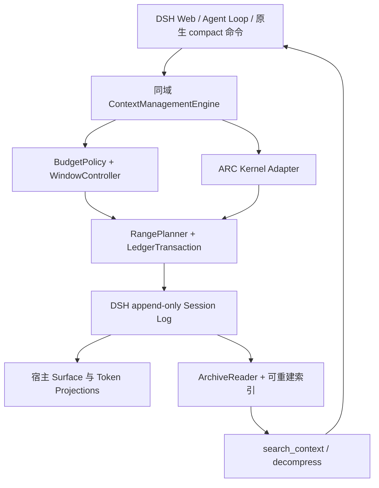

# 架构、换窗协议与持久化

本文件记录 v0.1.0 的**已实现架构与约束**。参数与产品范围以 [SPEC.md](SPEC.md) 为准。来源核验见 [SOURCES.md](SOURCES.md)，风险依据见 [REVIEW.md](REVIEW.md)。

## 1. 分层与所有权



建议源码拆分：

| 模块 | 所有权/职责 | 不应承担 |
|---|---|---|
| index/engine | CompactionEngine 三接口与服务注册 | 文本检索和索引实现 |
| bridge/host-adapter | preset 接管、宿主能力检测、hook/flush/计量适配 | 私自实现宿主 agent loop |
| budget-policy | P/C/R/S、压力分级、路由有效性 | 读取整个日志并再次扣 shadow |
| window-controller | pending、代际、状态转换、无进展控制 | 直接重写消息数组 |
| range-planner | surface 位置范围、工具配对、保护 fence | 用 seq 数值排序替代 surface 顺序 |
| ledger/transaction | 唯一生产 session.append 入口、版本/恢复 | 以 Map 代替持久事实 |
| archive-reader/index | 来源展开、查询、cursor、预算 | 写 surface 或执行历史指令 |
| arc-adapter | acp-kernel 状态、模型 compress、tier | 将所有档案自动变成 kernel block |
| handoff/prompts | 有界交接、模板校验、提示去重 | 将历史正文当新的系统规则 |
| tools/commands | 参数与输出适配 | 各自实现一套事务/预算逻辑 |

按 agent/session key 保存控制状态，不能全局共享一个 pending 标志。每次调用从实际 agent 解析服务，不能在 root 抓取一个 compaction 实例后给所有会话共用。

## 2. 从 Codex 采纳什么

本地源码显示：new_context handler 只请求换窗；session/turn 在一次采样及工具工作完成后的主循环分支处理。token-budget 路径走 compact_token_budget 生命周期，重建窗口，不额外调用摘要模型。AutoCompactWindow 管理窗口身份、prefill、每窗一次提醒；WorldState 管理当前状态与差量。

本项目采纳请求/执行分离、每窗状态、宿主权威状态、类型化边界、取消和可重放测试。BodyAfterPrefix 是“增长预算”，不等于“从当前压力减掉所有历史压缩量”；模型全窗口上限始终是独立硬边界。不得用两者数学“同效”的错误类比指导实现。

Codex context_management 在本地快照是 UnderDevelopment/default false，启用受模型与账号/路由能力门控。其 history-notes 不是 DSH 现成的通用存储。RetainedContext 的局部容量限制也不能证明 Codex 全部历史不可恢复。这里是工程借鉴，不是产品能力优劣宣言。

## 3. 新宿主的计量契约

### 三个量分开

1. **当前输入压力 P**：同路由且未失效的 contextPressure.projectedTokens。宿主已经折叠 surface 变化，不再扣任何累计账本。缺失时采用当前路由的完整 envelope + surface 估价；若只能取得 tokenMeter.totalTokens，作为明确标记的保守上界，不冒称精确输入值。
2. **归档区间的请求价格**：本次 tokenMeter.measure(session, currentHeader).nodes 中被选节点的 tokens，用于容量决策与是否有实际收益。
3. **持久 shadow price**：同快照节点的 **heuristicTokens** 之和，用于 compaction/summary.shadowedTokenCount。它与宿主 O(1) surface fold 的追加估价同口径；存在图片时不能用 route-priced tokens 替换。

快照包含 logRevision。提交前确认当前 surface seq 列表与价格快照仍有效；如果 metadata 事件改变 revision 而内容没变，也要重新取价/校验，不凭旧价格声明成功。缺失价格为错误，不视为零。新宿主缺少 tokenMeter 时，首发产品不执行自动压缩，显示 unsupported；测试最小宿主的估价 fallback 不构成生产支持。

容量来源顺序：用户显式限制只能向下约束路由容量；有效 request/context 与当前路由匹配时优先于探测缓存。没有可信容量则标记 unknown 并停止自动换窗建议，不使用“缓存大窗口”掩盖路由切换。人工 windowBudgetTokens 独立展示。

新的 usage 样本已经反映压缩后的请求；此时必须重新锚定，不能再次减历史累计 reclaim。压缩量统计仅供诊断，不能拿来算 P。多层归档可能反复遮蔽 checkpoint，累计 shadow 也不是唯一原文 token 数。

### 相邻写入是协议

本次探针证实，compaction/summary 产生一次性价格声明，**下一事件必须是对应的 surface replacement**。任何插入事件都会使声明过期。summary 与 replacement 之间不能 await、发会话 telemetry、写额外 window event，或调用可能追加事件的回调。

样例：P=10000、shadow=3000、checkpoint 计价84，宿主 P'=7084；旧 ARC 二次减后错成4084。详见 [projection-probe.json](evidence/projection-probe.json)。该探针用安装包真实纯函数，属于源码行为验证，不是 provider 压缩实测。

## 4. 范围与保留策略

使用宿主有序 surface 节点，不把 start<=end 当合法性条件：新 checkpoint 的高 seq 可以位于老消息之前。

换窗选择 **最新真实用户请求及其后全部节点之前，最大连续、工具配对平衡的前缀**。其中可以包含旧 ARC checkpoint 和旧 window seed；这样旧 seed 不会逐窗堆积。工具配对守卫必须验证前缀两端及整个剩余 surface。不能只复用 ARC buildCompressibleSeqRanges，因为该函数会跳过 checkpoint，并不代表整个旧窗口。

最新真实用户请求定义为当前有效 surface 上最后一个 source.kind=user 的用户输入；runtime/context/plugin 注入不能冒充它。并发新输入通过宿主 inbox 领取，在 pre-step 期间尚未成为日志时同样保留，禁止从 decision.messages 丢掉或排序重写。

没有可冻结前缀时不推进 generation。最新用户请求和必要尾部过大时，明确 no-safe-range；可用 ARC 本地压缩更早的已闭合安全范围，但不能为了“干净窗口”吞掉用户输入或未配对调用。

如果旧前缀不存在却请求 new_context，返回 no-op。没有净 token 缩减，或保留尾部使目标不可达到时，报告原因；一次 governor pass 最多一次换窗和一次尚未写入时的 fallback，避免循环。

## 5. 请求与执行状态机

```text
idle --new_context--> pending --next safe pre-step--> preparing
preparing --no-op/changed/cancel--> idle (不推进代际)
preparing --start/summary/replace--> applied --end+flush--> idle (新代际)
applied --end/flush failure--> recovery-required
pending --turn ended/dispose/cancel--> idle (请求取消)
```

new_context 工具调用本身不能冻结包含自己的 assistant call：结果尚未写入时配对不完整。工具仅保留 requestId（从 session/turn/tool-call 身份派生）、generation 和有界 handoff。重复调用幂等返回首次请求；不重复落账。

在下一 agent/pre-step 中，先等接管就绪，再与任何 compress/manual/governor 操作共用每 session 的 single-flight 锁。当前 step 已闭合，pending 的工具结果已可见。重新选择范围、计量、构造 seed、检查信号、提交，再继续宿主 waterfall。返回 decision 时保留全部字段，包括 startsRequestSeries；换窗后要求 startsRequestSeries=true，便于宿主记录新请求序列。

注意宿主 pre-step 之前已进行一次 prompt/tool 组装；不能假定修改插件 prompt 后本步会重新 assemble。档案 checkpoint 自身须包含新代际与恢复指引，nudge 不得把旧代际指令重新加入本步。应通过真实 loop 测试验证传给 provider 的最终消息。

pending 只在当前进程/当前活动轮次有效：取消、卸载或轮次结束即清除，重启不自动复活未提交意图。accepted 仅表示已接收；完成由下一步状态与持久 checkpoint 证明。已提交 requestId 从日志可辨认，防止重放工具调用造成重复窗口。

手动 `/context new` 必须通过 runMaintenance 同步取得 idle 操作权，用 turn:null；活动轮次自动路径使用当前 turn。两者复用核心准备/提交逻辑，不能复用“必须存在 open turn”的错误守卫。

## 6. 持久数据结构

不新增表面消息种类；沿用 compaction/start → compaction/summary → user/message(replace) → compaction/end。已有 ARC fields 保留读取；新增命名空间字段建议如下，字段需通过 P0 保存/读取实验证明可用：

```ts
interface ContextManagementMetadataV1 {
  schemaVersion: 1
  kind: 'window'
  operationId: string
  requestId?: string
  trigger: 'model' | 'manual' | 'pressure' | 'context-overflow'
  fromWindowId: string
  toWindowId: string
  generationAfter: number
  parentBlockIds: readonly string[]
  route: { provider: string; model: string }
  seed: { incomplete: boolean; formatVersion: 1 }
}
// compaction/summary.data.contextManagement?: ContextManagementMetadataV1
```

compactionId 与 checkpoint source 继续使用宿主官方构造器。operationId 等于事务 compactionId，不再引入第二套提交身份。generation 从0开始，首次成功换窗为1。初始 windowId 可以确定性派生 `session:<sessionId>/window:0`，后续 toWindowId 为随机 UUID，fromWindowId 指向当时有效窗口。键域始终是 `(sessionId,windowId)`。

时间使用事件自带 time，不再保存可矛盾的 frozenAt。summary 内容就是实际 checkpoint 的同一份有界 ContentBlock[]；不一处保存 24K 摘要、另一处写不对应的短 seed。原件由 shadowedSeqs 和父来源关系追踪，不把完整原文复制进摘要。

window 档案明确 kind=window，无 kernelBlockId，也不因 tier 缺省1而合成为 acp-kernel block。ARC state.rebuildKernelBlocks 当前会给无 ID 的每个账本项合成 bN，必须改造；运行中缓存和重启重建必须采用相同映射。档案层与 ARC 层共享来源 resolver，不共享“所有块都是压缩块”的假设。

fork：继承的窗口元数据是历史事实，查询限当前 Session 可见的继承事件；新窗口归属子 session，以继承最大 generation 为起点，使用新的 UUID。不能拿全局 windowId 直接打开父 session。首发是否支持具体子代理模式由 G5 单独决定。

### 账本状态不能只看 summary

读回时关联 compactionId、summary、官方 source 的 replacement、end，校验 window 字段类型/范围/父引用与当前 Session 归属。

| 日志形态 | 可见 surface/代际 | 状态及行动 |
|---|---|---|
| 无 start | 原样 | 未开始 |
| start，尚无 summary | 原样 | 遗留锁，遵循宿主恢复边界，不直接绕过锁 |
| summary，无 matching replacement | 原样、不推进 | orphan/prepared-only，不计作已归档，不减压力 |
| replacement 已在日志，end 缺失或错误 | 以实际 surface 为准，识别已应用的新代际 | applied-unclosed；不能回退代际或重新归档同一操作 |
| end 成功且 flush 成功 | 新代际 | committed |
| end 成功但 flush 失败 | 内存已应用，磁盘确认不明 | persistence-uncertain，阻止下一模型请求，提示恢复；不能声称成功保存 |

异常路径最多尝试一次闭合；闭合再失败保留原始错误及闭合错误。flush 使用宿主 sessions.flush(session)。本地生产模式必须有持久化能力；不因接口允许省略就把“成功留在内存”当可靠归档。

重启以宿主加载的 durable prefix 与 surface 为准，按官方残留锁/seed 生命周期处理；不得删改旧 start/end。需要修复标记时通过已验证的宿主恢复协议写追加事件，不自造 session/end-seed 绕过锁。未知 extension 版本只读降级；损坏来源不得进入正常窗口链。

## 7. 原件、检索与恢复

DSH 日志本身已保留历史；ARC 的价值是主动选择、索引、摘要与模型工具，不是首次创造原始事件存储。原件承诺针对本插件触达前已经持久化的事件结构。插件不承诺网络端从未返回、被上游截断或已删除的内容。

统一 resolver 按稳定 surface/来源顺序展开：window parent → ARC tier parent → 原始事件；pruner replacement 沿宿主 sourceEventSeqs 回溯到完整 tool/result。visited 集去重并检测环，缺 seq、未知 kind 和循环都输出 incomplete，不能把父摘要冒充原文。迭代遍历避免堆栈随窗口数增长。

查询默认当前 session，先增量维护文本段索引，候选匹配后再取 bounded snippet。首建允许 O(N) 扫描但可取消；每次 governor tick 不允许 O(全文大小) 拼接。摘要和原文分别注明来源，展示命中原因。v0.1.0 无需向量检索。

cursor 绑定 sessionId、blockId/query、schemaVersion、来源日志前缀指纹和偏移；拒绝跨会话/跨块或伪造偏移。纯追加且已有来源不变时可继续；来源不可用或 schema 变更时报 stale-cursor。偏移按 UTF-8 边界或 code point 计算，不在代理对/多字节字符中间截断。

decompress 按预算选页，再将来源与正文作为历史数据返回；所有包装也计入预算。重复恢复同一段需计入当时 P，不能因“检索是只读”忽略工具结果对窗口的增长。小块可整块恢复，大块通过分页恢复，全文导出不等于全文一次放回上下文。

图片/音频/二进制：日志保留事件及引用；文本检索只承诺 text block，返回非文本项清单。引用的文件/spill 不存在时标 missing-attachment，不替换成“已完整恢复”。保证完整二进制归档需要额外存储策略，不属 v0.1.0 承诺。

## 8. 信息边界与工程约束

handoff、模型摘要、历史文本不可信；用固定数据边界和来源标注，不复制成 system/developer 权限。抽取过滤只能减少风险，不能宣称“消毒后无注入”。最新有效用户请求保留原文；历史约束与后续更正冲突时保留时间和来源，不用旧摘要覆盖当前要求。

TypeScript strict、无 as any/@ts-ignore；用 Zod/Schemastery 等实际宿主接受的 schema 做运行时解析。纯策略与 I/O 解耦、typed error union、状态机穷举、参数化/性质测试、snapshot 与重放测试，是可借鉴的 Codex 工程实践。

日志不得含 API key、认证 Cookie、完整系统提示或隐私原文作为遥测字段。可观测字段只需操作 ID、代际、路由、预算、选中数量、阶段、耗时、incomplete 与错误码。证明原文相等用合成 fixture/hash，而非把用户全部历史复制到报告。


## 12. 已实现的宿主适配细节

- `agent/pre-step` 先取得下游完整 decision，再处理 pending/pressure；reject decision 不触发归档。新用户输入尚未入日志时，以其 ID 标识虚拟边界，并计入整批 admission messages 的输入价格。提交后保留宿主 decision 的所有字段，重建请求序列。
- 每次 system-prompt 组装保存当前 envelope 的私有会话快照；系统段、工具或路由发生变化时用新 envelope 测量。provider 请求入口另有当前容量/输出预留的最终预算检查。请求头按值比较；等价头且 usage 基线有效时沿用宿主投影，实际 system/tools/route 变化才使用新 envelope 的保守估算。
- Reader 按 Session 对象使用 WeakMap 持有增量账本、来源缓存及游标，不按可碰撞的会话字符串共享状态。游标为随机句柄加 MAC，服务端校验 scope、日志前缀指纹和偏移；最多 256 个，进程重启失效。
- 分页用实际 JSON UTF-8 大小二分选择文本长度，保证 Unicode 标量边界。并行检索共享一次 step 的剩余预算。检索描述明确只取当前任务需要的证据，按原语言逐字保留用户要求精确恢复的值。
- Window seed 的原始用户摘录与工具标量记录分开带来源，跨代际从原始 source graph 提取，不递归截断旧 seed 来替代原件。解析和摘录均有上限，不额外调用摘要模型。
- 真实 Web 对照保留全部失败样本。模型回答准确率与事件原文的 100% 恢复率分别报告；安全预算拒绝不等于 provider 物理 overflow。

- 压缩的净输入收益扣除被选中、随后会由宿主重建的最新 `skill-catalog` 与插件 `form:snapshot`，并预留包装开销；持久 shadow 仍独立使用原节点 `heuristicTokens`，不能混用两种价格。模型摘要、窗口交接与本地兜底共用收益计算。
- 批量 `compress` 对每段在修改 kernel 状态和追加事件前校验精确范围。后段触及最新用户或不满足工具配对时返回该段拒绝；前段已提交结果保留并 flush，不将普通参数拒绝升级为整会话恢复失败。
- 跨父档案的全文搜索将同一个原始 seq 归属到最早档案，分页沿用此归属；不同 seq 即使文本相同仍是不同来源。会话内归属表有上限，超过上限允许重复命中，不丢弃来源。
