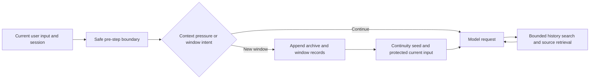

# Design

[简体中文](DESIGN.zh-CN.md) · [Home](../README.en.md)

Context grows throughout a long task. A summary can lose details, while carrying every historical message consumes the model's working window. This plugin separates the active working context from recoverable source history: the active window stays bounded, and historical text remains in session events for retrieval within a budget.

## Flow

The default `windowed` strategy advances to a new window under context pressure and carries continuity information forward. `new_context` accepts an intent; the mutation commits at the next safe pre-step boundary, protecting current user input and tool call/result pairs. An `in-place` strategy can fold older content within the current window. Their measured differences appear in the [test report](TESTING.en.md).

## Four constraints

1. **Recoverable history.** Compression and window changes append events through a shared transaction instead of deleting original records. Summaries may omit details; archived sources remain searchable and pageable. Reversible means source recovery, not lossless summaries or guaranteed model recall.
2. **No double deduction.** Budgeting starts with the host's projected token estimate and reserves room for output and a safety margin. Adjacent summary/replacement shadow pricing uses host `heuristicTokens`; the archive ledger is never subtracted again from host `projectedTokens`.
3. **Explicit ownership.** Pending window changes belong to a session; cancellation and disposal clean them up. Persisted records support restart recovery. No hidden global session singleton coordinates state.
4. **Bounded retrieval.** `search_context` and `decompress` return session-local historical data with scan limits, response budgets, scoped cursors, and explicit incomplete/error states. Retrieved text is not promoted to a new system instruction.

## DSH integration

Installation enables the bundle in the target profile. The bridge locates existing native Basic instances and replaces them in their actual preset scopes. It handles first requests, preset switches, and presets added later without rewriting host preset files. Native `/compact` uses the replacement engine; `/context` exposes status. Removing the bundle lets the host restore Basic.

Presets without native compaction, including official `minimal`, remain without it. Third-party compaction backends remain unchanged. Other DSH versions require separate validation.

## Attribution

Selected implementation is adapted from MIT-licensed `dsh-arc-context`, with reversible operations based on pinned `acp-kernel` 0.0.24. Codex informed window lifecycle design; no Codex runtime code is included. Host packages remain external, with no absolute imports into reference repositories or host installations. See [NOTICE](../NOTICE.md) and [third-party licenses](../THIRD_PARTY_LICENSES.md).
