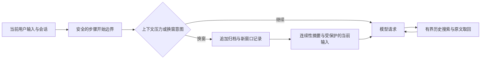

# 设计思路

[English](DESIGN.en.md) · [返回首页](../README.md)

长任务中的上下文会持续增长。只保留一段摘要容易丢失细节；一直携带所有历史又会挤占模型的可用窗口。本插件把“当前工作上下文”和“可查回的历史原文”分开：当前窗口保持有界，历史保存在会话事件中，需要时按预算检索。

## 工作流程

默认 `windowed` 策略在上下文压力升高时推进到新窗口，把连续性信息带入下一阶段。`new_context` 只提交换窗意图；实际修改在下一次安全的步骤开始边界完成，保护当前用户输入以及工具调用、结果的配对关系。`in-place` 策略可在当前窗口折叠旧内容，作为另一种配置保留；两种策略的实测差异见[测试报告](TESTING.zh-CN.md)。

## 可选后台摘要与按需等待

显式配置 `backgroundSummary` 后，默认 `delivery: deferred`：后台在旧窗口提前准备有来源哈希的摘要；换窗先提交确定性索引并保留当前输入、近期工具配对，摘要继续运行。Harness 在后续本来就要执行的安全 pre-step 把就绪摘要作为历史数据追加，追加成功后才标记 delivered，不再次替换窗口，也不会仅因摘要就绪而在最终答案后多发一次模型请求。

模型可依据当前数据继续独立工作；仅当下一步需要缺失历史时调用 `await_context`，等待同一个后台任务。工具返回状态，摘要正文由下一次宿主边界追加。取消、超时、来源过期和交付预算不足有明确状态，原文仍可检索。窗口事务持久化 pending 来源，因此通知尚未追加时重启也能报告 interrupted。摘要上限默认独立为 4096 UTF-8 字节，仍通过宿主 token 余量校验。

`allowSameProvider` 默认 false；并发云路由需显式 true。`delivery: seed` 保留上一阶段的边界即时采用/未就绪回退模式用于对照。未配置后台功能不注册 `await_context`。最新验证与配置见[下一轮报告](ITERATION-DEFERRED-HANDOFF.zh-CN.md)。

## 四个约束

1. **历史可查回。** 压缩与换窗通过共享事务追加事件，不原地删除原始记录。摘要可能遗漏细节，归档原文仍可搜索和分页取回。“可逆”指原文可恢复，不代表摘要无损或模型一定能正确回忆。
2. **预算不重复扣减。** 以宿主实际投影的 token 估算为基础，为输出和安全余量留出空间。相邻摘要与替换记录的影子计价使用宿主 `heuristicTokens`；不从宿主 `projectedTokens` 再减去归档账本。
3. **生命周期明确。** 待执行换窗属于具体会话，取消和销毁负责清理。持久化记录支持重启后恢复；不通过隐藏的全局会话单例协调。
4. **检索有界。** `search_context` 和 `decompress` 返回当前会话中的历史数据，限制扫描量、返回量与分页游标作用域，明确暴露不完整或错误状态。检索原文不被当作新的系统指令。

## 接入 DSH

安装时启用目标 profile 的 bundle，由 bridge 找到 preset 中实际存在的原生 Basic 实例，在对应作用域内替换。处理首次请求、预设切换和后续加入的预设，不改写宿主预设文件。原生 `/compact` 使用接管后的引擎，`/context` 提供状态信息。卸载移除 bundle 后，宿主恢复自己的 Basic。

这不是向所有预设强行添加压缩：官方 `minimal` 没有原生压缩，保持不启用；第三方压缩后端也保持原样。其他 DSH 版本需要单独验证。

## 来源

选定实现改编自 MIT 许可的 `dsh-arc-context`，可逆层基于固定版本 `acp-kernel` 0.0.24；Codex 启发了换窗生命周期设计，没有引入 Codex 运行时代码。宿主包保持外部依赖，没有绝对路径的参考仓库或宿主安装目录导入。完整来源及许可证见 [NOTICE](../NOTICE.md) 和 [第三方许可证](../THIRD_PARTY_LICENSES.md)。
